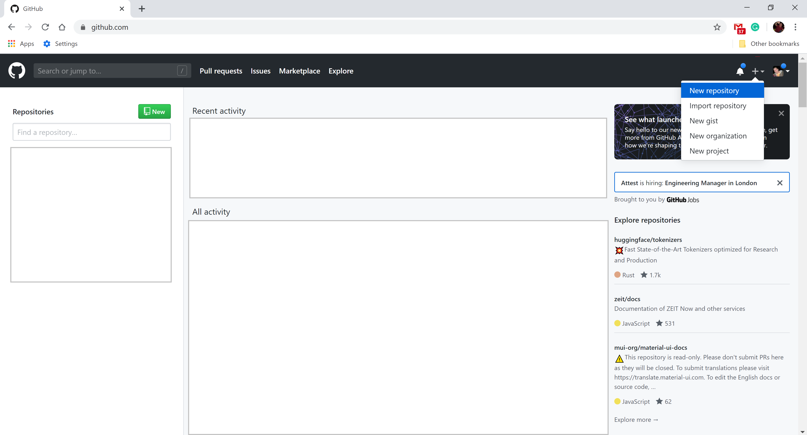
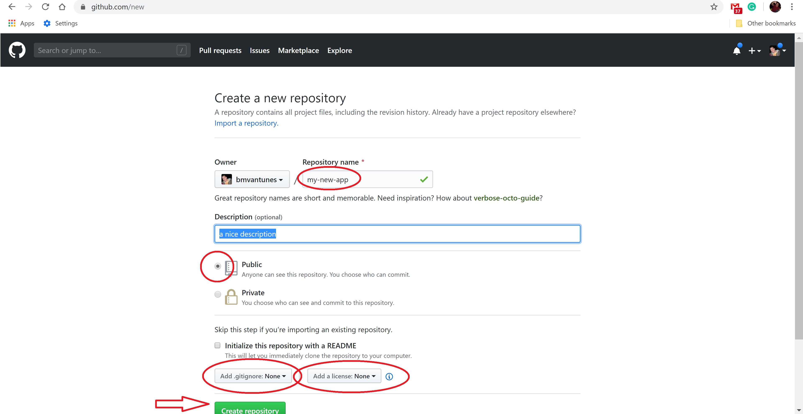
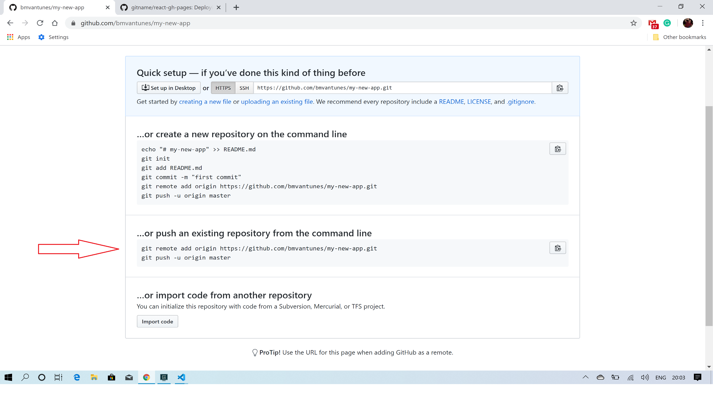

It's quite common that after you work for a while in a project you want to share the code with others.
For software developers the most common platforms to share code are:
- Github
- Bitbucket
- Gitlab

In this blog post, we are going to use Github. I'll guide you step by step.

Let's break it in 4 different steps:
1. Create your project
2. Create a new Github repository
3. Push your changes to the newly created repository
4. Do the changes you want, commit, push... and repeat :)

### Assumptions:
I'm assuming [node.js](https://nodejs.org/en/) and [git](https://git-scm.com/downloads) are already installed

# 1. Create your project

Open your terminal (on mac) or cmd (on windows)
```sh
npx create-react-app my-new-app
```

This command will scaffold (create) a completely new react project for you.
The project will be inside the folder my-new-app - Keep in mind this command can take a while...

If you prefer to have your react project in typescript, please do the following command instead
```sh
npx create-react-app my-new-app --template typescript
```

In order to open your project root folder type in your terminal
```sh
cd my-new-app
```

You are now in the project root folder. Run your newly created project:
```sh
npm start
```

After a few seconds, your browser will open with your app

2. Create a new Github repository

Open your browser at `https://github.com/`

You'll see


If you already have an account login, if not signup.

After you login/signup you'll see


Just click in "New repository" and You'll end up in this page


Choose your repository name and details wisely.
Then click "Create repository".

# 3. Push your changes to the newly created repository

After clicking "Create Repository" in step 2, you'll end up on this page:


Grab the details from the second section and paste it into your terminal
```sh
git remote add origin https://github.com/bmvantunes/my-new-app.git
git push -u origin master
```

At this stage, your terminal will prompt for your username and password.
After you insert them you should see something like:
```
Username for 'https://github.com': your-username
Password for 'https://your-username@github.com':
Enumerating objects: 19, done.
Counting objects: 100% (19/19), done.
Delta compression using up to 8 threads
Compressing objects: 100% (13/13), done.
Writing objects: 100% (13/13), 1.12 MiB | 1.46 MiB/s, done.
Total 13 (delta 2), reused 0 (delta 0)
remote: Resolving deltas: 100% (2/2), completed with 2 local objects.
```

If you refresh your browser, you'll see that your code is now in GitHub, available to the world 🎉


# 4. Do the changes you want, commit, push... and repeat

Anytime you want to share your new changes with others you can run the following 2 commands
```sh
git commit -am "my message representing the changes"
git push
```

Keep iterating and sharing your achievements with all of us! :)
